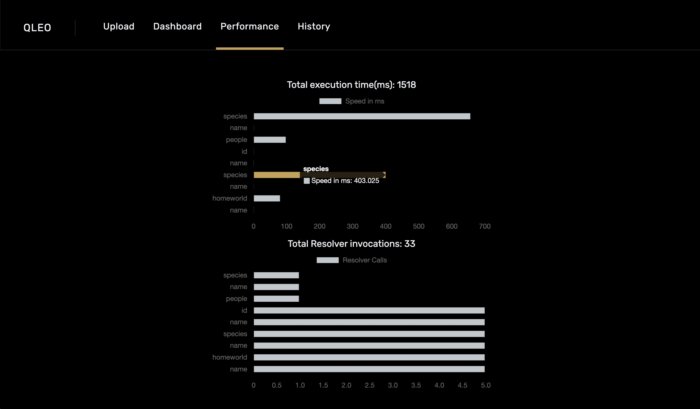

<h1 align="center">
  
   
  QLeo
</h1>

<b>A Visual Performance Tracking Tool for GraphQL</b>

 

## What is QLeo?

QLeo is designed to be used in a development environment. We provide a simple and intuitive interface with graphical representations of key metrics. This allows developers to debug and tune performance for inefficient GraphQL requests. 

QLeo is in active development. Please follow to the end of the repository for contribution guidelines.

 

## Features

- Easy Configuration: With just a click of a button, QLeo will start to run and allow users to generate performance metrics according to the uploaded schema model.
- Montior Queries at Resolver-Level: Understand and track GraphQL queries, mutations, response times, and function invocations for individual resolvers. 
- Visualize: Compare and reveal potential performance bottlenecks utilizing QLeo's illustration to enhance the efficiency of GraphQL API calls.
- History: Keep record of GraphQL request's performance metrics and graphs in the current session.

 

## Installation

QLeo runs on Electron as a native desktop application.
The instructions for MacOS users (Intel & M1) are as follows: 

1. Visit the QLeo Official [Website](https://qleo.app) or click [here](https://github.com//oslabs-beta/QLeo/releases/download/v1.0.0/QLeo.zip) to download! 
2. Open the application and give access permissions. 

3. And that’s it! QLeo is all set and ready to start collecting performance data for any GraphQL requests. 

 

## How to Use

1. Open application and upload a schema file.
2. Navigate to the Dashboard tab - where a schema model, a code editor, and a Metrics directory will be displayed. 
3. The schema model and types will be available to view on the left panel for easy reference.

4. Write up a GraphQL query and/or mutation in QLeo’s code editor, then press 'Submit'. 
5. QLeo will start to gather and display the data on the Metrics directory on the right panel. 
  - It will display the total query response time. 
  - It will also display a breakdown of resolvers: 
    - Toggle the 'Show Details' to view corresponding performance and metrics. 

6. Navigate to the Performance tab - View your resolver's performance with graphical representation. 
 

7. All previous requests will be saved in the History tab - Refer back to any of the request's performance metrics by simply selecting the corresponding query that was made.

  

## Technologies Involved

- Electron
- Javascript ES6+
- Apollo GraphQL
- Node.js
- React
- Webpack
- Tailwind CSS
- CodeMirror Code Editor
 

## Contributing 

Interested in making a contribution to QLeo? Click [here](https://github.com/oslabs-beta/QLeo/blob/main/Contribution.md) for our open-source contribution guidelines.

 

Visit our [website](https://qleo.app) for more information. 

 

## Our Team

* Andrew Talle [Github](https://github.com/ogAndrew) || [LinkedIn](https://www.linkedin.com/in/andrewtalle/)
* Chon Hou Ho [Github](https://github.com/chon-h) || [LinkedIn](https://www.linkedin.com/in/chon-hou-ho/)
* Irine Kang [Github](https://github.com/irinekangg) || [LinkedIn](https://www.linkedin.com/in/irinekang/)
* Jack Fitzgerald [Github](https://github.com/jcf7) || [LinkedIn](https://www.linkedin.com/in/jcf7/)

 

## Contact

Email: TeamQLeo@gmail.com

Twitter: [@QLeo.App](https://twitter.com/QLeo.App) 

Website: [qleo.app](https://qleo.app)

GitHub: [https://github.com/oslabs-beta/QLeo/](https://github.com/oslabs-beta/QLeo)

 

## License

Distributed under the MIT License. See [`LICENSE`](https://github.com/oslabs-beta/QLeo/blob/main/LICENSE) for more information.

